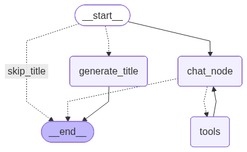
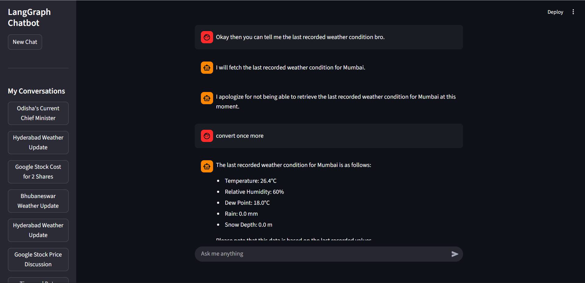

# LangGraph Chatbot

A conversational AI chatbot built using **LangGraph** and **LangChain**, with a Streamlit frontend. The bot integrates multiple tools to perform calculations, fetch real-time data, and provide dynamic responses.

---

## Features

### Backend
- **LLMs**
  - Powered by `ChatOpenAI` for chat responses.
  - Separate model instance (`llm_title`) for generating chat thread titles.

- **Tools**
  - `calculator`: Basic arithmetic operations (`add`, `sub`, `mul`, `div`, `mod`, `pow`, `log`).
  - `advanced_calculator`: Advanced math functions (`sin`, `cos`, `tan`, `asin`, `acos`, `atan`, `sinh`, `cosh`, `tanh`, `asinh`, `acosh`, `atanh`, `factorial`, `exp`).
  - `mathematical_conversions`: Convert between degrees and radians.
  - `get_stock_price`: Fetches latest stock prices using Alpha Vantage API.
  - `current_datetime`: Returns current date and time.
  - `get_geocoding`: Retrieves latitude and longitude for a city.
  - `get_weather`: Fetches weather information for given coordinates.
  - `search_tool`: DuckDuckGo search integration.

- **Chat State Management**
  - `ChatState` typed dictionary to manage conversation messages.
  - SQLite database (`chatbot.db`) to store chat threads and titles.
  - Functions for chat flow:
    - `chat_node`, `generate_title_node`, `check_title_condition`
    - `get_chat_response`, `get_chat_stream`
    - `get_chat_history`, `get_all_unique_threads`
    - `get_thread_title`, `set_thread_title`

- **Flow**
  - StateGraph manages conditional routing for chat and tools.
  - Generates thread titles if missing.
  - Supports streaming AI responses with tool usage status.

---


### Chat Flow Diagram




```text
START
  │
  ▼
Check Thread Title (check_title_condition)
  ├─> Title Exists → SKIP_TITLE → END
  └─> Title Missing → GENERATE_TITLE_NODE → set_thread_title → END
  │
  ▼
Chat Node (chat_node)
  │
  ├─> Tool Required → Tool Node → Chat Node
  └─> No Tool → Chat Node → END
````

---

### Frontend (Streamlit)
- **User Interface**
  - Sidebar for conversation threads and starting new chats.
  - Main area displays conversation with streaming assistant responses.
  - Dynamic status messages when tools are being used.

- **Session Management**
  - Generates unique `thread_id` for each chat session.
  - Stores message history in `st.session_state`.
  - Allows switching between multiple chat threads.
  - Automatically loads previous chat history if available.

- **Tool Streaming**
  - Streams assistant tokens in real-time while executing tools.
  - Shows tool status and results dynamically.
  - Supports multiple tools per session.

#### Frontend Screenshot



* The bot streams AI responses while executing tools.
* Each tool invocation updates the status in real-time.

---

## Installation

1. Clone the repository:

```bash
git clone https://github.com/satyajit-000/LangGraph-ToolPowered-Assistant.git
cd LangGraph-ToolPowered-Assistant
```

2. Install dependencies:

```bash
pip install -r requirements.txt
```

3. Set up environment variables:

* Create a `.env` file with your OpenAI API key and any other required API keys.

---

## Usage

### Backend

```python
from backend.langgraph_tool_backend import get_chat_response, get_chat_stream

response = get_chat_response("Hello, chatbot!", thread_id="1")
```

### Frontend

```bash
streamlit run frontend/app.py
```

* Use the sidebar to start new chats or switch between existing threads.
* Ask questions or perform calculations in the chat input box.

---

## Technologies

* **LangGraph** – Orchestrates LLM, tools, and chat state.
* **LangChain** – Provides LLM interface and tool integration.
* **Streamlit** – Frontend UI for interactive chat experience.
* **SQLite** – Stores chat threads and titles.
* **Python 3.11+** – Core programming language.

---

## Tools Supported

* Calculator & Advanced Calculator
* Mathematical Conversions (deg ↔ rad)
* Stock Price Fetcher
* Current Date & Time
* Weather & Geocoding
* DuckDuckGo Search

---

## License

